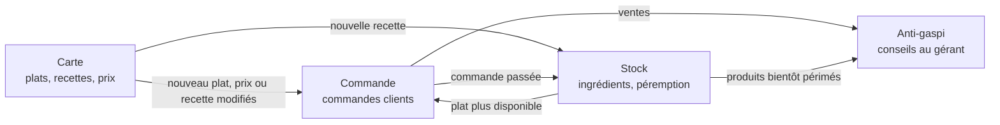

# TableFlow

> Projet NoSQL, Mastère Data Engineering & IA, EFREI Paris (M1)
> Équipe : _Prénom Nom_, _Prénom Nom_, _Prénom Nom_, _Prénom Nom_

TableFlow est la plateforme de données d'un réseau de restaurants. Elle ne propose pas d'interface graphique : ce projet porte sur la façon dont les données sont organisées, partagées et transformées entre plusieurs services.

---

## 1. Le problème de départ

Prenons un groupe d'une dizaine de restaurants qui vendent sur place et en livraison. Chaque jour, trois situations reviennent.

**Le client allergique ne peut pas faire confiance à la carte.**
Un chef change une recette, mais la carte affichée n'est pas mise à jour. Le client commande un plat qu'il croit sans arachide, alors qu'il en contient désormais.

**Le client commande un plat qui n'existe plus.**
À 13 h, il ne reste plus de poulet, mais le plat est toujours proposé. La cuisine découvre le problème au moment de préparer la commande : il faut appeler le client, le rembourser, et il ne reviendra peut-être pas.

**Le gérant jette de la marchandise.**
Il reçoit des produits frais qui périment dans deux jours, mais il ne sait pas quels plats mettre en avant pour les écouler à temps.

Ces trois problèmes ont la même cause : **l'information existe, mais elle n'arrive pas au bon endroit au bon moment.**

## 2. Ce que fait TableFlow

| Pour qui | Ce que TableFlow garantit |
|---|---|
| Le client | Il voit des allergènes toujours à jour, et ne peut commander que ce qui est réellement disponible |
| La cuisine | Elle ne reçoit que des commandes qu'elle peut préparer |
| Le gérant | Il sait chaque jour quels plats mettre en avant pour limiter le gaspillage |

## 3. L'architecture choisie

Plutôt qu'un seul gros système qui sait tout, TableFlow est découpé en **trois services**, chacun responsable d'un métier précis, et un **quatrième service d'analyse** construit à partir des autres.

| Service | Son métier | Il est le seul à pouvoir modifier... |
|---|---|---|
| **Carte** | Décrire ce que propose chaque restaurant | les plats, les recettes, les prix, les allergènes |
| **Stock** | Savoir ce qu'il reste en cuisine | les quantités d'ingrédients et leurs dates de péremption |
| **Commande** | Enregistrer ce que les clients achètent | les commandes et leur statut |
| **Anti-gaspi** | Conseiller le gérant | rien : il ne fait que lire et analyser |

### Pourquoi découper ?

- **Chaque service peut fonctionner seul.** Si le service Carte tombe en panne pendant le rush de midi, les clients peuvent toujours commander.
- **Chaque service a un seul responsable de ses données.** Un prix n'est modifié qu'à un seul endroit, ce qui évite les contradictions.
- **Chaque service peut utiliser la base de données la plus adaptée à son métier.** Une commande, un stock qui bouge à chaque seconde et un historique de ventes n'ont pas les mêmes besoins.

### Comment les services se parlent

Les services ne s'interrogent pas en permanence. Quand quelque chose d'important se produit chez l'un, il **l'annonce** (« le prix du poulet yassa a changé »), et les services concernés mettent à jour leur propre copie de l'information.

C'est comme dans une cuisine : le chef ne demande pas toutes les deux minutes s'il reste des oignons. C'est le commis qui prévient quand il n'y en a plus.

## 4. Les commandes

Une **commande** est une demande adressée à un service pour qu'il fasse quelque chose. Elle peut être acceptée ou refusée.

| Service | Commande | Ce qu'elle demande |
|---|---|---|
| Carte | Créer un plat | Ajouter un plat à la carte d'un restaurant, avec sa recette et son prix |
| Carte | Modifier un prix | Changer le prix d'un plat |
| Carte | Modifier une recette | Changer les ingrédients d'un plat (et donc ses allergènes) |
| Stock | Réceptionner une livraison | Ajouter une quantité d'ingrédient, avec sa date de péremption |
| Commande | Passer une commande | Un client achète un ou plusieurs plats dans un restaurant |
| Commande | Annuler une commande | Un client ou le restaurant annule une commande |

Exemple de refus : une commande est refusée si l'un des plats n'est plus disponible, ou s'il contient un allergène que le client a déclaré.

## 5. Les agrégats

Un **agrégat** est l'ensemble des informations qu'un service garde ensemble, parce qu'elles forment un tout cohérent.

| Agrégat | Service | Ce qu'il contient |
|---|---|---|
| **Plat** | Carte | Nom, restaurant, prix, recette (ingrédients et quantités), allergènes |
| **Stock d'un ingrédient** | Stock | Restaurant, ingrédient, quantité restante, lots et dates de péremption |
| **Commande** | Commande | Client, restaurant, plats achetés avec leur prix et leurs allergènes **au moment de l'achat**, total, statut |

**Un choix important :** une commande garde une photo du prix et des allergènes au moment de l'achat. Si le prix ou la recette change le lendemain, la commande d'hier reste exacte. C'est indispensable pour la facturation, et surtout en cas de réaction allergique.

## 6. Les réplicats

Un **réplicat** est une copie, dans un service, d'une information qui appartient à un autre service.

| Information copiée | Propriétaire | Copiée dans | Pourquoi |
|---|---|---|---|
| Nom, prix, allergènes d'un plat | Carte | Commande | Pour prendre une commande sans dépendre du service Carte |
| Disponibilité d'un plat | Stock | Commande | Pour refuser immédiatement un plat épuisé |
| Recette d'un plat | Carte | Stock | Pour savoir quels ingrédients retirer quand un plat est vendu |

La copie n'est jamais modifiée directement par le service qui la détient : elle est uniquement mise à jour par les annonces du service propriétaire.

## 7. Les événements

Un **événement** est l'annonce d'un fait qui s'est produit. Il est défini par son émetteur, ses destinataires, la donnée modifiée et sa nouvelle valeur.

| Événement | Émetteur | Destinataires | Donnée concernée | Effet |
|---|---|---|---|---|
| Plat créé | Carte | Commande, Stock | Le plat complet | **Crée** les copies |
| Prix modifié | Carte | Commande | Le prix | Met à jour la copie |
| Recette modifiée | Carte | Commande, Stock | La recette et les allergènes | Met à jour la copie |
| Commande passée | Commande | Stock, Anti-gaspi | Les plats vendus | Le stock diminue |
| Plat indisponible | Stock | Commande | La disponibilité | Le plat ne peut plus être commandé |
| Produit bientôt périmé | Stock | Anti-gaspi | L'ingrédient, la quantité, la date | Déclenche une analyse |

### Ce que nous acceptons

Entre le moment où un événement est annoncé et celui où il est pris en compte, il s'écoule un très court délai. Pendant ce délai, un client pourrait commander le dernier poulet yassa juste avant qu'il soit marqué indisponible. Nous acceptons ce risque, très rare, en échange de services autonomes. Nous expliquerons comment nous le gérons dans la partie technique.

## 8. La projection : le service Anti-gaspi

Une **projection** transforme des données existantes pour répondre à une nouvelle question. Ici, la question du gérant est :

> « Quels plats dois-je mettre en avant demain, et combien de portions dois-je en vendre, pour ne pas jeter mes produits ? »

Pour y répondre, le service Anti-gaspi croise :

1. les produits qui périment bientôt (venant du Stock) ;
2. les plats qui utilisent ces produits (venant de la Carte) ;
3. les ventes habituelles de ces plats (venant des Commandes).

Il produit chaque jour, pour chaque restaurant, une courte liste : _ingrédient à écouler, plats à mettre en avant, nombre de portions visé._

## 9. Les données utilisées

- **Ingrédients et allergènes :** données réelles issues d'Open Food Facts, une base ouverte et collaborative de produits alimentaires.
- **Restaurants, plats et commandes :** générés par nos soins pour simuler un mois d'activité d'un réseau de restaurants, avec des pics réalistes à midi et le soir.

## 10. Organisation de l'équipe

| Membre | Responsabilité |
|---|---|
| _Prénom Nom_ | Service Carte et import des données Open Food Facts |
| _Prénom Nom_ | Service Stock |
| _Prénom Nom_ | Service Commande et génération des données de test |
| _Prénom Nom_ | Communication entre services, service Anti-gaspi, documentation |

La définition des commandes et des agrégats est faite **par toute l'équipe ensemble**, car tout le reste du projet en dépend.

## 11. Étapes du projet

- [x] Choix du sujet et description du projet
- [ ] Définition des commandes (format détaillé)
- [ ] Définition des agrégats (format détaillé)
- [ ] Définition des événements et des réplicats
- [ ] Définition de la projection Anti-gaspi
- [ ] Choix des bases de données et mise en place
- [ ] Réalisation des services
- [ ] Tests sur un mois d'activité simulée
